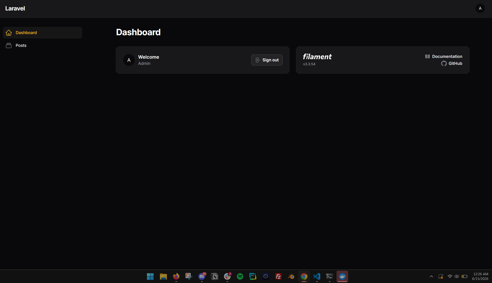

# Contribution 1: [Feature Request]: Image Resizing Inside Editor #91

**Contribution Number:** 1  
**Student:** Sujal Ratna Tamrakar  
**Issue:** [GitHub issue link](https://github.com/rawilk/filament-quill/issues/91)  
**Status:** Phase II Complete

---

## Feature Summary

Added opt-in image resizing and alignment inside the Quill editor using `quill-blot-formatter`. Images can now be resized with drag handles and aligned left, center, or right from the overlay toolbar, with resized dimensions and alignment persisted as HTML attributes.

---

## Why I Chose This Issue

I chose this issue because it aligns perfectly with my existing experience working within the Laravel and Filament PHP ecosystems. The feature request addresses a highly practical capability—allowing users to intuitively resize images directly within the rich-text editor UI. Currently, integrating third-party resizing packages with this specific Filament wrapper is complex, leaving a clear gap that would highly benefit the project's user base.

Furthermore, this issue presents an excellent open-source opportunity because the project maintainer explicitly stated that while they appreciate the feature, it is not a high priority for them right now and they are openly welcoming a community pull request. Working on this will allow me to deepen my understanding of custom form component integrations in Filament, learn how to bridge frontend editor modules with backend configurations, and deliver a feature that the community is actively waiting for.

---

## Understanding the Issue

### Feature Description

The objective is to introduce a seamless, interactive image resizing mechanism directly within the Quill rich-text editor instance managed by this Filament package. Currently, users have no inline layout controls to scale, resize, or modify dimensions of an image post-upload inside the workspace. Implementing this will add critical editorial flexibility, ensuring content creators can format complex layouts intuitively without depending on raw HTML overrides.

### Expected Behavior

When an image node is selected or clicked within the rich-text input field:
1. Interactive resize handles or a dedicated overlay container should appear around the perimeter of the image element.
2. Users should be able to click and drag the corners to scale the image proportionally, or select predefined percentage/pixel sizing controls via a popup tool block.
3. The newly generated height and width dimensions must automatically synchronize with the element's styling or attributes, correctly updating the underlying saved HTML output payload seamlessly.

### Current Behavior

Once an image is inserted or dropped into the active workspace editor:
- It displays rigidly at its initial or native dimensions.
- Clicking or focusing on the image element fails to evoke any responsive resizing tools, handles, or adjustment settings within the component canvas interface.

### Affected Components

- **Local Package Architecture Source Space:** Located within the manually registered path route `/var/www/filament-quill/src/`. This directory hosts the backend class logic, field component definitions, and trait structures that build the interface wrapper.
- **Frontend JavaScript & Asset Compilation Pipelines:** The underlying scripts where the third-party Quill engine and its default module systems are configured, compiled, and registered.
- **Component Blade Views & Livewire Bridges:** The field templates rendering the asset layer that must pass custom user/system initialization configurations downstream into the active editor instance.

---

## Understanding the Issue

### Feature Description

The objective is to introduce a seamless, interactive image resizing mechanism directly within the Quill rich-text editor instance managed by this Filament package. Currently, users have no inline layout controls to scale, resize, or modify dimensions of an image post-upload inside the workspace. Implementing this will add critical editorial flexibility, ensuring content creators can format complex layouts intuitively without depending on raw HTML overrides.

### Expected Behavior

When an image node is selected or clicked within the rich-text input field:
1. Interactive resize handles or a dedicated overlay container should appear around the perimeter of the image element.
2. Users should be able to click and drag the corners to scale the image proportionally, or select predefined percentage/pixel sizing controls via a popup tool block.
3. The newly generated height and width dimensions must automatically synchronize with the element's styling or attributes, correctly updating the underlying saved HTML output payload seamlessly.

### Current Behavior

Once an image is inserted or dropped into the active workspace editor:
- It displays rigidly at its initial or native dimensions.
- Clicking or focusing on the image element fails to evoke any responsive resizing tools, handles, or adjustment settings within the component canvas interface.

### Affected Components

- **Local Package Architecture Source Space:** Located within the manually registered path route `/var/www/filament-quill/src/`. This directory hosts the backend class logic, field component definitions, and trait structures that build the interface wrapper.
- **Frontend JavaScript & Asset Compilation Pipelines:** The underlying scripts where the third-party Quill engine and its default module systems are configured, compiled, and registered.
- **Component Blade Views & Livewire Bridges:** The field templates rendering the asset layer that must pass custom user/system initialization configurations downstream into the active editor instance.

---

## Reproduction Process (Local Development Setup)

### Environment Setup

To establish a local development and testing environment for this feature, I constructed an isolated Docker runtime sandbox using Windows WSL2 and Laravel Sail, bypassing complex package version dependency deadlocks through a manual tracking layout.

- **WSL2 Subsystem Integration:** Configured Docker Desktop settings to activate the Ubuntu integration bridge, running `wsl --shutdown` via PowerShell to completely flush the subsystem's active memory layout before initializing a clean terminal.
- **Host Sandbox Infrastructure:** Utilized Laravel's automated installation wrapper (`laravel.build`) to initialize a clean development host application named `filament-test-app` inside the Linux `~/code` workspace.
- **Dependency Bypass via PSR-4 Autoloading:** Due to strict framework versioning constraints matching Laravel 12 and older dependency conflicts, typical local path configurations via Composer were blocked. To circumvent this calculation loop, I bypassed standard package registry installations and manually registered the package fork directly inside `filament-test-app/composer.json` using a native PSR-4 mapping strategy:
  ```json
  "autoload": {
      "psr-4": {
          "App\\": "app/",
          "Database\\Factories\\": "database/factories/",
          "Database\\Seeders\\": "database/seeders/",
          "Rawilk\\FilamentQuill\\": "/var/www/filament-quill/src/"
      }
  }
  ```
  Following registration, I ran `composer dump-autoload` inside the active container to map the file routes.
- **Database Engine Optimization:** Configured the empty MySQL container using `php artisan migrate`, removed mass assignment protections on the base User model, and populated admin authentication credentials using `php artisan make:filament-user`.

### Steps to Verify Environment Setup

1. Spin up the local containerized environment via Laravel Sail using `./vendor/bin/sail up -d`.
2. Generate a fresh dashboard test area using `php artisan make:filament-resource Post` paired with its database structural model `php artisan make:model Post -m`.
3. Execute `php artisan migrate` to synchronize the structural post schemas into the database instance.
4. Launch the local application workspace by navigating to `http://localhost/admin` inside the browser.

### Development Evidence

- **Development Branch Link:** [Link to your local development branch on GitHub]
- **Screenshots/Logs:** 

- **My Findings:** The host development platform successfully mounts, resolves, and loads the backend class files nested inside the local package mapping space (`/var/www/filament-quill/src/`). The development environment is fully operational and listening to structural code modifications. The next step is evaluating the frontend build system setup to determine how the Quill editor initializes its JavaScript module ecosystem.

---

## Solution Approach

### Analysis

The package serves as a specialized Filament wrapper configuration layer around the Quill rich-text editor, bridging backend PHP settings to a frontend JavaScript canvas initialization. Because the core Quill engine manages advanced capabilities through modular plugin extensions, inline image resizing is completely missing by default. To isolate how the package registers modules, we must trace the asset configuration bridge:
1. **The Core Field:** `src/Forms/Components/Quill.php` handles configuration states on the PHP side.
2. **The View Layer:** `resources/views/forms/components/quill.blade.php` renders the wrapper HTML container.
3. **The Script Bootstrapper:** `resources/js/filament-quill.js` executes the actual `new Quill()` instantiation and defines the module arrays passed to the editor.

### Proposed Solution

The implementation used a multi-layered approach to safely vendor and expose the resizing module. I added `quill-blot-formatter` to the frontend assets, exposed a clean backend toggle on the PHP field class, passed that flag through the Blade/template layer into the editor bootstrap, and conditionally injected the resizing module into the Quill configuration.

The editor also uses a custom image blot so resized width/height values and alignment survive save/reload instead of being stripped by Quill's default image blot.

### Implementation Plan

Using UMPIRE framework (adapted):

**Understand:** Provide an intuitive, interactive inline image resizing mechanism inside the Filament Quill editor view. When an image node is selected, drag handles or overlay dimension toggles must appear, updating the inline HTML style output seamlessly upon save.

**Match:** I will inspect how the package handles other pre-configured toolbar matrices or customizable options (like custom image uploading paths or standard text alignments) inside `src/Forms/Components/Quill.php` and its matching blade template to mirror how state options are passed down to the client layout.

**Plan:**
1. **Frontend Asset Discovery:** Located the primary JavaScript build array inside `resources/js/` and wired the external module into the `Quill` instance.
2. **Expose Fluent PHP API:** Added a fluent configuration method:
   ```php
   public function allowImageResizing(bool | Closure $condition = true): static
   ```
3. **Template Data Bridge:** Updated the component data extractor layer to emit the boolean state flag downstream into the JavaScript boot configuration.
4. **JavaScript Module Injection:** Updated the constructor options array inside `resources/js/` to detect the incoming configuration flag and register the resizing plugin within the active `modules: {}` object block.
5. **Recompile Package Assets:** Rebuilt the package assets so the new editor behavior ships in the published bundle.

**Implement:** Completed in the `feature/image-resizing` commit.

**Review:** I will check the root directory for a `CONTRIBUTING.md` file to verify coding standards, strict type declarations, and pull request naming conventions. I will also check the package git log to match the maintainer's preferred commit message style (e.g., Conventional Commits).

**Evaluate:** Verified with Pint and the Pest suite, plus manual editor testing to confirm resized dimensions and alignment persist cleanly in saved HTML.

---

## Testing Strategy

### Unit Tests

- Verifies image resizing is off by default.
- Verifies `allowImageResizing()` enables the feature.
- Verifies a closure condition can enable or disable the feature dynamically.

### Integration Tests

- Verifies the global config default enables resizing when set in `config/filament-quill.php`.
- Verifies a field-level override disables resizing even when the config default is enabled.

### Manual Testing

I tested the editor flow in the browser by uploading an image, resizing it with drag handles, changing alignment with the overlay toolbar, and saving the content. The resulting HTML kept the resized width/height and `data-align` values, and the image rendered correctly after reload.

---

## Implementation Notes

### Week 1 Progress

I traced the Quill initialization path, identified where editor modules are assembled, and added the opt-in resizing toggle to the PHP API and frontend bootstrap.

### Week 2 Progress

I finished the custom image blot, Livewire state synchronization, and styling updates, then rebuilt the assets and validated the end-to-end editor behavior.

### Code Changes

- **Files modified:** `resources/js/quill.js`, `resources/js/blots/resizable-image.js`, `resources/css/blots/resize.css`, `resources/css/content.css`, `resources/css/app.css`, `src/Concerns/HasQuillOptions.php`, `config/filament-quill.php`, `tests/Feature/ImageResizingTest.php`, `README.md`
- **Key commits:** `feature/image-resizing`
- **Approach decisions:** Used `quill-blot-formatter` for the resize UI, persisted image metadata as attributes instead of inline styles, and added Livewire syncing so direct DOM mutations stay in editor state.

---

## Pull Request

**PR Link:** [[PR URL HERE](https://github.com/rawilk/filament-quill/pull/142)]

**PR Description:** Added opt-in image resizing and alignment to the Quill editor field using `quill-blot-formatter`. The update includes a backend toggle, attribute-based persistence for resized images, Livewire synchronization, themed UI styling, and test coverage.

**Maintainer Feedback:**
- [Pending]: [No maintainer feedback yet]

**Status:** Awaiting review

---

## Learnings & Reflections

### Technical Skills Gained

I learned how to bridge a Quill plugin into a Filament field, preserve custom image metadata through Quill blots, and sync direct DOM changes back into Livewire state.

### Challenges Overcome

The hardest part was making resize mutations persist without breaking Quill state updates. I solved that by combining a custom image blot with a targeted mutation observer and a guard against self-originated state re-renders.

### What I'd Do Differently Next Time

I would start the editor-state persistence design earlier, since resize plugins often mutate the DOM directly and need special handling beyond standard Quill text-change events.

---

## Resources Used

- [Quill documentation](https://quilljs.com/)
- [Filament documentation](https://filamentphp.com/docs)
- [Issue #91 discussion](https://github.com/rawilk/filament-quill/issues/91)
